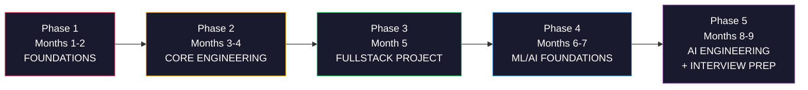

# THE PLAN — From Zero to Hired

## *A Scientifically-Grounded Combat Plan for Divyansh Joshi*
### *Built on Deliberate Practice, Spaced Repetition, Ultralearning — Not Vibes*

---

> [!CAUTION]
> **The Brutal Truth Before We Start**
>
> You are trying to learn **6 domains** (Java, Python, DSA, React/MERN, ML, AI) with **6 hours/day**. Every successful self-taught developer who got hired in under 12 months did it by **going deep on fewer things, not wide on everything**. The research is unanimous: breadth without depth gets you zero interviews.
>
> This plan does NOT try to make you "master" all 6 simultaneously. It **sequences** them so each phase builds on the last, and you have **deployable proof of skill** at every checkpoint — because proof is what gets you hired, not knowledge.

---

## Part 0: Your Honest Audit (Where You Actually Are)

| Domain | Current State | Evidence |
|:---|:---|:---|
| **Python** | Beginner-Intermediate | Can write DSA solutions, basic scripting (job pipeline). No OOP depth, no frameworks. |
| **Java** | Beginner | Know it exists in your plan. Zero solved problems in Java. No evidence of JVM understanding. |
| **DSA** | Early Beginner | 4/15 problems on Pattern 1 (Two Pointers). Patterns 2–15 untouched. ~25 total problems solved. |
| **React/MERN** | Zero | No projects, no code, no evidence. |
| **ML/AI** | Zero | No projects, no code, no evidence. |
| **Job Hunting** | Infrastructure Built | Automated email pipeline exists. Resume exists. But no portfolio to show. |

> [!IMPORTANT]
> **The core problem**: You have a job-hunting *machine* but nothing to *sell*. Your pipeline drafts emails and sends resumes — but your resume has no projects that prove you can build. This plan fixes that by making you produce **real, deployed artifacts** on a schedule.

---

## Part 1: The Science This Plan Is Built On

This isn't motivational advice. These are peer-reviewed findings that dictate how the plan is structured.

### 1.1 — Anders Ericsson's Deliberate Practice (2016)

> *"Doing the same thing over and over again in the same way is not deliberate practice. Deliberate practice involves well-defined, specific goals — and the crucial thing is that the practice takes place outside one's comfort zone."*

**How this plan uses it**: Every week has a specific, measurable deliverable (not "study React"). You will be uncomfortable. That's the signal it's working.

### 1.2 — Ebbinghaus Forgetting Curve & Spaced Repetition

> *Without review, you forget 70% of new material within 48 hours.*

**How this plan uses it**: You already have Anki. Every concept you learn gets a card **the same day**. The first 20 minutes of every study session is Anki review. Non-negotiable.

### 1.3 — Cal Newport's Deep Work

> *"The ability to perform deep work is becoming increasingly rare at exactly the same time it is becoming increasingly valuable."*

**How this plan uses it**: Your 6 study hours are split into **three 2-hour Deep Work blocks** with enforced 15-min physical breaks. No phone, no YouTube, no social media during blocks. Use Cold Turkey or similar.

### 1.4 — Scott Young's Ultralearning — The Directness Principle

> *"We learn best when we practice doing the thing we actually want to get good at."*

**How this plan uses it**: From Week 3 onward, you are **building projects**, not watching tutorials. You learn React by building in React. You learn ML by training models on real data. Every phase ends with a deployed project on your GitHub.

### 1.5 — Interleaved Practice (Rohrer & Taylor, 2007)

> *Mixing different problem types during practice leads to 43% better test performance than studying one type at a time.*

**How this plan uses it**: Your 3 daily blocks are **cognitively different** (analytical → systems/theory → building). This prevents the attention decay that happens when you study one thing for 6 hours straight.

---

## Part 2: The Daily Schedule (12:00 PM – 8:00 PM)

```
┌──────────────────────────────────────────────────────────────────┐
│                    YOUR 8-HOUR DAY                               │
├──────────┬───────────────────────────────────────────────────────┤
│ 12:00 PM │ ☕ JOB HUNT BLOCK (2 hours)                          │
│          │ • 12:00–12:30: Run your pipeline, review new leads    │
│          │ • 12:30–1:30:  Customize & send 5-8 applications      │
│          │ • 1:30–2:00:   LinkedIn outreach (2-3 DMs to people   │
│          │                in roles you want, NOT recruiters)      │
├──────────┼───────────────────────────────────────────────────────┤
│  2:00 PM │ 🧠 BLOCK 1: DSA + Language (2 hours) [HARDEST]      │
│          │ • 2:00–2:20:   Anki review (all decks)                │
│          │ • 2:20–2:30:   Read pattern/concept (10 min max)      │
│          │ • 2:30–4:00:   Solve problems (20-min struggle rule)  │
│          │                Write in BOTH Java and Python           │
├──────────┼───────────────────────────────────────────────────────┤
│  4:00 PM │ 🚶 PHYSICAL BREAK (15 min) — walk, no screens        │
├──────────┼───────────────────────────────────────────────────────┤
│  4:15 PM │ 🛠️ BLOCK 2: Build (2 hours) [REACT/MERN or ML/AI]  │
│          │ • Phase 1-3: React & MERN projects                    │
│          │ • Phase 4-5: ML & AI projects                         │
│          │ • 15 min learn → 105 min code (no tutorials > 15 min) │
├──────────┼───────────────────────────────────────────────────────┤
│  6:15 PM │ 🚶 PHYSICAL BREAK (15 min) — eat, move, no screens   │
├──────────┼───────────────────────────────────────────────────────┤
│  6:30 PM │ 📖 BLOCK 3: CS Theory + Depth (2 hours)              │
│          │ • Phase 1-2: OS, Networks, System Design reading       │
│          │ • Phase 3-5: ML math, papers, LLD/HLD                  │
│          │ • Read 5-10 pages → write summary from memory          │
│          │ • Last 15 min: make Anki cards for today's learnings   │
├──────────┼───────────────────────────────────────────────────────┤
│  8:30 PM │ 🛑 STOP. Done. No "just one more thing."             │
│          │ • Before bed: open tomorrow's first file on screen.    │
│          │   Zero-click start tomorrow.                           │
└──────────┴───────────────────────────────────────────────────────┘
```

> [!WARNING]
> **The 20-Minute Struggle Rule (Ericsson)**
> When solving a DSA problem: code for 20 minutes without ANY hints. If stuck after 20 min, look at ONLY the pattern classification (not the solution). Try 10 more minutes. Only then read the solution — and then **close it and rewrite from memory**. If you can't rewrite it, you didn't learn it.

---

## Part 3: The 9-Month Phase Plan

### The Sequence Logic



> [!TIP]
> **Why this order?** Python is the language of ML/AI. Java is the language of DSA interviews. React/MERN gives you a fullstack portfolio piece FAST. ML/AI comes after you can already code and build — because ML without engineering skill is just running notebooks, and nobody hires notebook-runners.

---

### 🔴 PHASE 1: Foundations (Months 1–2) — *"Learn to Fight"*
**Total Hours: ~360 (6h × 60 days)**

#### Block 1 — DSA + Languages (2h/day)

| Week | DSA Pattern | Problems to Solve (Java + Python) | Language Focus |
|:---|:---|:---|:---|
| 1–2 | Two Pointers (finish it) | Complete remaining 11 problems from your context.md list | Java basics: types, loops, arrays, methods |
| 3–4 | Sliding Window | Max Subarray K, Longest Substring K Distinct, Fruit Into Baskets + 5 more | Java: String, StringBuilder, HashMap |
| 5–6 | Fast & Slow + Binary Search | LinkedList Cycle, Happy Number, Search Rotated Array, Koko Bananas + 6 more | Java: LinkedList, OOP basics, Comparable |
| 7–8 | Merge Intervals + Cyclic Sort | Merge Intervals, Insert Interval, Missing Number, First Missing Positive + 4 more | Python: `collections`, `heapq`, generators |

**Targets by end of Phase 1:**
- [ ] **60+ DSA problems solved** (each in BOTH Java and Python)
- [ ] **Java**: Can write any solution without syntax errors. Understand JVM basics (stack/heap, GC).
- [ ] **Python**: Comfortable with all built-in data structures, list comprehensions, lambda/map/filter.
- [ ] **Anki**: 200+ cards created and being reviewed daily.

#### Block 2 — React Foundations (2h/day)

| Week | Learn | Build |
|:---|:---|:---|
| 1–2 | HTML/CSS deep dive (Flexbox, Grid, responsive) + JS fundamentals (closures, promises, async/await, event loop) | 3 static responsive pages from scratch (NO frameworks) |
| 3–4 | React core: Components, Props, State, Hooks (`useState`, `useEffect`, `useRef`) | **Project 1**: Personal portfolio website (deployed on Vercel) |
| 5–6 | React Router, Context API, fetching APIs | **Project 2**: Weather dashboard using a public API (OpenWeatherMap) |
| 7–8 | Node.js basics, Express routing, REST API design | Build a simple REST API for a to-do app (local, not deployed yet) |

**Targets by end of Phase 1:**
- [ ] **2 deployed React projects** on Vercel with source on GitHub.
- [ ] Can build a React component from scratch without docs.
- [ ] Understand HTTP methods, status codes, JSON, REST conventions.

#### Block 3 — CS Theory (2h/day)

| Weeks | Topic | Resource | Deliverable |
|:---|:---|:---|:---|
| 1–4 | Operating Systems | OSTEP (free online), Ch. 1–22 | Handwritten summaries. Write a multi-threaded program in Java (producer-consumer). |
| 5–8 | Computer Networks | Kurose & Ross, Ch. 1–3 | Build a raw TCP client in Python that sends an HTTP GET request. |

---

### 🟠 PHASE 2: Core Engineering (Months 3–4) — *"Build Real Things"*
**Total Hours: ~360**

#### Block 1 — DSA (2h/day)

| Week | Pattern | Target |
|:---|:---|:---|
| 9–10 | In-place LinkedList + BFS/DFS | Reverse LL, Level Order Traversal, Number of Islands |
| 11–12 | Two Heaps + Subsets | Find Median, Permutations, Palindrome Partitioning |
| 13–14 | Greedy + Prefix Sum | Jump Game, Gas Station, Subarray Sum Equals K |
| 15–16 | Stack + DP intro | Valid Parentheses, Daily Temperatures, Climbing Stairs, Coin Change |

**Target**: **120+ total problems** (Java + Python). All 15 patterns covered at basic level.

#### Block 2 — MERN Fullstack (2h/day)

| Week | Learn | Build |
|:---|:---|:---|
| 9–10 | MongoDB (Atlas), Mongoose ODM, Express middleware | Backend API with auth (JWT), user registration/login |
| 11–12 | React state management (Redux Toolkit or Zustand), protected routes | Connect frontend to backend. Role-based access. |
| 13–16 | WebSockets (Socket.io), file uploads (Cloudinary/Multer), payment (Razorpay) | **Project 3: Full MERN App** — see below |

**🏆 Project 3: Real-Time Collaboration Board (Trello Clone)**
- React frontend with drag-and-drop (react-beautiful-dnd)
- Express + MongoDB backend with JWT auth
- Real-time sync across users via Socket.io
- Deployed: Frontend on Vercel, Backend on Render, DB on MongoDB Atlas
- **This is your headline portfolio project. It must be polished.**

#### Block 3 — CS Theory + System Design Intro (2h/day)

| Weeks | Topic | Deliverable |
|:---|:---|:---|
| 9–12 | Computer Networks Ch. 4–6 + DNS/HTTP deep dive | Write a Python HTTP server from scratch (no frameworks) |
| 13–16 | Low-Level Design (LLD) patterns: Strategy, Factory, Observer, Singleton | Implement 4 design patterns in Java with driver code |

---

### 🟢 PHASE 3: The Portfolio Sprint (Month 5) — *"Ship or Die"*
**Total Hours: ~180**

> [!IMPORTANT]
> **This is the most important month.** By the end of this month, your GitHub must have 3 deployed, documented, portfolio-grade projects. This is what you send to employers. Everything before this was training. This month is the fight.

#### Block 1 — DSA (2h/day)
- **DP mastery**: Tabulation-first approach. LCS, Knapsack, Edit Distance, Longest Increasing Subsequence.
- **Bit manipulation**: Single Number, Count Bits, Power of Two.
- **Target**: **150+ total problems**. Start doing timed mock interviews (45 min, 2 problems).
- Run mock interviews using [Pramp](https://www.pramp.com) (free, peer-to-peer).

#### Block 2 — Polish & Ship (2h/day)
- **Week 1–2**: Polish Project 3 (Trello clone). Add: loading states, error handling, responsive design, proper README with GIFs, clean code.
- **Week 3–4**: **Project 4: Job Portal** (a meta-project — you're building the thing you need)
  - Companies post jobs, candidates apply
  - Role-based access (admin/user)
  - Resume upload via Cloudinary
  - Search & filter
  - Deployed end-to-end

#### Block 3 — Python for ML Prep (2h/day)
- **Math refresh**: Linear algebra (vectors, matrices, dot product), probability (Bayes' theorem), basic calculus (derivatives, chain rule). Use 3Blue1Brown's *Essence of Linear Algebra* (YouTube, free).
- **Python for Data**: NumPy, Pandas, Matplotlib. Work through Kaggle's free "Intro to" micro-courses (they're short and hands-on).
- **SQL basics**: SELECT, JOIN, GROUP BY, subqueries. Use [SQLBolt](https://sqlbolt.com) (free, interactive).

---

### 🔵 PHASE 4: ML/AI Foundations (Months 6–7) — *"Become Dangerous with Data"*
**Total Hours: ~360**

#### Block 1 — DSA Maintenance (1.5h/day, reduced)
- Solve 3 problems/week to maintain. Focus on patterns you're weakest in.
- Do 1 mock interview/week on Pramp.
- Start LeetCode contest participation (weekly, timed).

#### Block 2 — Machine Learning (2.5h/day, expanded)

| Week | Topic | Hands-On |
|:---|:---|:---|
| 21–22 | Supervised Learning: Linear/Logistic Regression, Decision Trees, SVMs | Scikit-learn. Predict house prices (Kaggle). Predict loan default (Kaggle). |
| 23–24 | Ensemble Methods: Random Forest, XGBoost, cross-validation, hyperparameter tuning | **Project 5**: Credit card fraud detector. Real Kaggle dataset. Full pipeline: EDA → feature engineering → model → evaluation. |
| 25–26 | Deep Learning: Neural networks, backprop, PyTorch basics | MNIST classifier. Then: sentiment analysis on movie reviews (IMDB dataset). |
| 27–28 | NLP/Transformers intro: Tokenization, embeddings, Hugging Face `transformers` library | Fine-tune a small pre-trained model (DistilBERT) for text classification. |

#### Block 3 — CS Theory → ML Theory (2h/day)

| Weeks | Topic | Resource |
|:---|:---|:---|
| 21–24 | Probability & Statistics for ML | Think Stats (free book) or StatQuest (YouTube) |
| 25–28 | Deep Learning Theory | 3Blue1Brown Neural Networks series + Andrew Ng's ML Specialization (Coursera, audit free) |

**Targets by end of Phase 4:**
- [ ] **Project 5 deployed** (Streamlit frontend + model) on Hugging Face Spaces or Streamlit Cloud.
- [ ] Can explain bias-variance tradeoff, overfitting, regularization, gradient descent from memory.
- [ ] Comfortable with PyTorch: can build a 3-layer neural network from scratch.

---

### 🟣 PHASE 5: AI Engineering + Interview Prep (Months 8–9) — *"Close the Deal"*
**Total Hours: ~360**

#### Block 1 — Interview DSA (1.5h/day)
- **Target**: 200+ total problems.
- Do 3 mock interviews/week. Record yourself explaining solutions.
- Focus: System design questions (LLD + HLD). Practice explaining trade-offs.
- Review your error log — redo every problem you ever got wrong.

#### Block 2 — AI Engineering (2.5h/day)

| Week | Topic | Build |
|:---|:---|:---|
| 29–30 | RAG (Retrieval-Augmented Generation): Vector DBs (FAISS/ChromaDB), embeddings, LangChain | **Project 6**: A RAG chatbot that answers questions from your own uploaded documents. FastAPI backend. React frontend. |
| 31–32 | Model Deployment: FastAPI, Docker basics, cloud deployment (free tier: Render/Railway) | Dockerize Project 5 and Project 6. Deploy on cloud. |
| 33–34 | Agentic AI: LangChain agents, tool-calling, function calling with LLM APIs | Extend Project 6 with agent capabilities (web search, code execution). |
| 35–36 | Portfolio polish, resume update, interview prep | Every project has: professional README, demo GIF, live link, clean code. |

#### Block 3 — System Design + Interview Prep (2h/day)

| Weeks | Focus |
|:---|:---|
| 29–32 | HLD: Load balancing, database sharding, caching (Redis), message queues. Study real system designs (URL shortener, Twitter feed, chat system). |
| 33–36 | Behavioral interview prep. STAR method. Prepare 8 stories from your projects. Practice out loud — not in your head. |

---

## Part 4: The Portfolio You'll Have

By Month 9, your GitHub shows:

| # | Project | Stack | Proves |
|:---|:---|:---|:---|
| 1 | Personal Portfolio Site | React, Vercel | Frontend skills, deployment |
| 2 | Weather Dashboard | React, API integration | API consumption, state management |
| 3 | Real-Time Collab Board (Trello) | **Full MERN + WebSockets** | Fullstack engineering, real-time systems |
| 4 | Job Portal | **Full MERN + Auth + File Upload** | Complex backend, role-based access, business logic |
| 5 | Credit Card Fraud Detector | Python, Scikit-learn, Streamlit | ML pipeline, real-world data, model evaluation |
| 6 | RAG Document Chatbot | Python, FastAPI, LangChain, React | AI engineering, vector DBs, deployment |

> [!TIP]
> **Every project must have**: A live deployed link, a professional README (Problem → Solution → Architecture → How to Run), a demo GIF/video, and clean modular code. One polished project > five half-finished ones.

---

## Part 5: The Exact Resources (No Bloated Lists)

> [!WARNING]
> **The Rule**: You are allowed ONE primary resource per topic. Not five YouTube playlists. Not three courses. ONE. Finish it. Then move on. Tutorial-hopping is the #1 killer of self-taught developers.

| Domain | Primary Resource | Why This One |
|:---|:---|:---|
| **Java** | *Head First Java* (book) or Kunal Kushwaha's Java playlist (YouTube, free) | Conceptual, not syntax-dump. Teaches OOP properly. |
| **Python** | *Automate the Boring Stuff* (free online) for basics → *Fluent Python* for depth | Practical from day 1. Fluent Python teaches the "why" behind Python. |
| **DSA** | Your existing guideline.md pattern list + NeetCode 150 (neetcode.io) | Pattern-based. Video explanations for every problem. |
| **React** | Official React docs (react.dev) — the new tutorial is excellent | Written by the React team. Better than any course. |
| **Node/Express** | The Odin Project — NodeJS path (free) | Project-based. No hand-holding. |
| **MongoDB** | MongoDB University free courses (learn.mongodb.com) | Official. Short. Hands-on. |
| **ML** | Andrew Ng's ML Specialization (Coursera, audit free) | The gold standard. Math + intuition + code. |
| **Deep Learning** | fast.ai Practical Deep Learning (free) | Top-down: build first, understand theory after. |
| **AI/RAG/LLMs** | LangChain docs + DeepLearning.AI short courses (free) | Most current. Directly applicable to Project 6. |
| **System Design** | *System Design Interview* by Alex Xu (Vol 1) | Concise. Real examples. Diagrams. |
| **OS** | OSTEP — *Operating Systems: Three Easy Pieces* (free online) | Best OS textbook. Free. Readable. |
| **Networks** | *Computer Networking: A Top-Down Approach* (Kurose & Ross) | Standard. Application-layer first = immediately useful. |

---

## Part 6: Weekly Self-Audit (The Scientific Feedback Loop)

Copy this into your Obsidian every Sunday night. **Be honest or the plan is useless.**

```markdown
## 📊 Week [N] Self-Audit — Date: ____

### Quantitative
- Total hours studied: ___ / 42
- DSA problems solved this week: ___ (Java: ___ | Python: ___)
- Cumulative DSA problems: ___ / [phase target]
- Anki cards created this week: ___
- Anki review streak: ___ / 7 days
- Applications sent: ___
- LinkedIn DMs sent: ___
- Lines of project code written: ___

### Qualitative (Feynman Test)
Pick the hardest concept you studied this week. Explain it below
in 3 sentences as if teaching a 12-year-old. If you can't, you
didn't learn it — go back and re-study it tomorrow.

**Concept**: ____
**Explanation**: ____

### Error Log (Deliberate Practice)
| What I got wrong | Why I got it wrong | What I'll do differently |
|:---|:---|:---|
| | | |

### Honest Flags
- [ ] I watched tutorials for more than 30 min today without coding
- [ ] I copied code without understanding it
- [ ] I skipped Anki review
- [ ] I got distracted for more than 15 min during a Deep Work block
- [ ] I avoided a hard problem and did an easy one instead

If any box is checked, that's your #1 priority to fix next week.

### Next Week's 3 Goals (Specific, Measurable)
1. ____
2. ____
3. ____
```

---

## Part 7: Job Hunting Strategy (12:00 – 2:00 PM Daily)

Your automated pipeline handles the mechanical work. Here's what YOU focus on during those 2 hours:

### The Daily 2-Hour Playbook

| Time | Action |
|:---|:---|
| 12:00–12:20 | Run pipeline. Review new scraped leads. Delete irrelevant ones. |
| 12:20–1:00 | **Targeted applications** (5-8 per day). Customize the first 2 lines of each cover letter to mention the company's product. Use your pipeline's drafted emails as a starting point but EDIT them. |
| 1:00–1:30 | **LinkedIn outreach**: Find 2-3 people at target companies who are in roles you want (SDE, ML Engineer, Fullstack Dev). Send them a message asking about their work — NOT asking for a job. Build relationships. |
| 1:30–2:00 | **Portfolio maintenance**: Update GitHub READMEs, add a project GIF, push today's DSA solutions. Your GitHub must look active every single day (green squares). |

### Where to Apply (India, 2026)

| Platform | Best For |
|:---|:---|
| **Wellfound** (formerly AngelList) | Startups — they value skills over degrees |
| **LinkedIn** | Networking + direct company applications |
| **Internshala / Unstop** | Internships that convert to full-time |
| **Naukri / Cutshort** | Volume applications |
| **Company career pages directly** | Zoho, Razorpay, CRED, Postman, Freshworks, Flipkart, Meesho |
| **Your own pipeline** | Your automated scraper + emailer (keep improving it!) |

### Target Roles to Apply For

| Role Title | Why | When You're Ready |
|:---|:---|:---|
| **Frontend Developer (React)** | Lowest barrier to entry | After Phase 2 (Month 4) |
| **MERN Stack Developer** | Your strongest portfolio proof | After Phase 3 (Month 5) |
| **Python Developer** | DSA + scripting + your pipeline | After Phase 1 (Month 2) |
| **Junior ML Engineer** | After you have Project 5 + 6 | After Phase 5 (Month 9) |
| **AI Engineer** | The differentiator role | After Phase 5 (Month 9) |

> [!TIP]
> **Start applying from Month 2, not Month 9.** You don't wait until you're "ready." You apply, get rejected, learn what interviews actually ask, and adjust your study plan based on real feedback. Rejection is data.

---

## Part 8: The Anti-Failure Rules

These are the failure modes I see from your current setup. Memorize them.

| ❌ Failure Mode | 🔬 Why It Fails (Science) | ✅ The Fix |
|:---|:---|:---|
| Watching 3-hour tutorial videos | Passive learning creates "illusion of competence" (Bjork, 2013) | 15 min learn → 105 min code. Hard cap. |
| Solving problems only in Python | Interviews are in Java (India). You'll freeze. | Every DSA problem in BOTH languages. No exceptions. |
| Planning without executing | Planning feels productive but produces zero output | No planning sessions > 15 min. Open IDE and type. |
| Switching resources mid-topic | Novelty bias. New resource = new dopamine = no depth. | ONE resource per topic. Finish it or abandon the topic. |
| Skipping Anki | You'll forget 70% of what you learned last week | 20 min every day. Before anything else. Streak is sacred. |
| Building only CRUD apps | Recruiters have seen 10,000 to-do apps | Your projects have: real-time features, auth, payments, ML models |
| Studying 6h of the same subject | Cognitive fatigue after ~90 min (Kahneman, 2011) | 3 blocks × 2 hours. Different cognitive domains. |
| Not deploying projects | A local project is invisible to employers | If it's not live with a URL, it doesn't exist |

---

## Part 9: Monthly Checkpoint Deliverables

**These are non-negotiable. If you miss a checkpoint, you must course-correct the next week, not ignore it.**

| Month | Must Have Completed | Proof |
|:---|:---|:---|
| **1** | 30 DSA problems (Java+Python). Java syntax fluent. 1 deployed React site. | GitHub commit history. Live Vercel link. |
| **2** | 60 DSA problems. Patterns 1-6 covered. 2 React projects deployed. | GitHub. Vercel links. Anki deck at 200+ cards. |
| **3** | 90 DSA problems. Express + MongoDB API built. Backend connected to React. | API works locally. Can demo end-to-end. |
| **4** | 120 DSA problems. **Project 3 (Trello clone) deployed.** 4 LLD patterns implemented in Java. | Live links. README with GIFs. |
| **5** | 150 DSA problems. **Project 4 (Job Portal) deployed.** ML math + Python data stack learned. | Two fullstack deployed apps. Kaggle profile created. |
| **6** | ML fundamentals done. **Project 5 (Fraud Detector) deployed.** | Streamlit/HF Spaces link. Kaggle notebooks. |
| **7** | Deep Learning basics. Fine-tuned a transformer model. Mock interviews started. | Model on HF Hub. Pramp interview history. |
| **8** | **Project 6 (RAG Chatbot) deployed.** System design fundamentals. | Live app. Can whiteboard URL shortener design. |
| **9** | 200+ DSA problems. All 6 projects polished. Resume updated. Doing 3 mocks/week. | Ready to interview. Portfolio site links everything. |

---

## Part 10: Start Right Now

Don't read this document again. You've read it once. That's enough.

### Your task for TODAY:

1. **Open your context.md** — Problem #5 (Remove Duplicates from Sorted Array) is next.
2. **Solve it in Python first**, then rewrite it in Java.
3. **Make 5 Anki cards** from today's work.
4. **Install Node.js** if you haven't. Run `npx create-react-app test-app` just to see it work.
5. **Send 5 job applications** through your pipeline.

That's it. Not more. Not less. Go.

---

> *"The best time to plant a tree was 20 years ago. The second best time is right now."*
> — Chinese Proverb
>
> *"But the third best time is not tomorrow. It's still right now."*
> — The science of procrastination (Steel, 2007)
