# 🧠 The Computer Scientist's Scientific Learning Roadmap
## *A 9-Month Rigorous Curriculum for Systems Builders (6 Hours/Day)*

> [!IMPORTANT]
> This guide replaces passive planning with **Cognitive Science principles** (Cognitive Load Theory, Deliberate Practice, and Interleaved Learning). You have 6 hours daily (42 hours/week). If you try to study 6 hours of a single subject, your brain will enter cognitive fatigue within 2 hours, leading to distraction. 
> To bypass this, we partition your day into three cognitively distinct blocks.

---

## 🔬 Cognitive Science Learning Principles

1. **Active Recall & Retrieval Practice**:
   - Never read code or solutions passively. You only learn when your brain is forced to retrieve information from memory.
   - **Method**: After studying a concept, close the screen and write it out. For languages, write code from memory. If you use Anki, write code snippets on the cards, not just text.
2. **Cognitive Load Partitioning**:
   - *Intrinsic Load* is the difficulty of the topic. *Extraneous Load* is the noise (messy environments, confusing IDEs, notifications).
   - **Method**: Minimize extraneous load by using simple tools, blocking distracting sites, and keeping your workspace completely silent. Divide your 6 hours into three 2-hour blocks with 30-minute breaks to reset your working memory.
3. **Interleaved Study (Subject Rotation)**:
   - Studying one subject for 6 hours causes rapid attention decay. Mixing math/algorithms, hardware/concurrency, and application building forces the brain to form stronger, more flexible neural connections.
4. **Friction Management (Anti-Distraction)**:
   - **High Friction for Distractions**: Put your phone in a physical drawer in another room. Set a DNS-level blocker (like Cold Turkey) to restrict social media and YouTube during study hours.
   - **Low Friction for Work**: Before you sleep, open the next day's coding file on your screen. The next day, when you sit down, the barrier to start is exactly zero clicks.

---

## 🌐 Language Mastery: Java & Python

To become a **Computer Scientist**, you must understand the underlying execution model of your languages, not just their syntax.

```
┌─────────────────────────────────────────────────────────────┐
│                       LANGUAGE MAPPING                      │
├──────────────────────────────┬──────────────────────────────┤
│ JAVA (Statically Typed)      │ PYTHON (Dynamically Typed)   │
├──────────────────────────────┼──────────────────────────────┤
│ - Bytecode execution on JVM  │ - Interpreted (CPython VM)   │
│ - Stack vs Heap memory       │ - Everything is an object    │
│ - Garbage Collection (GC)    │ - Reference counting & GIL   │
│ - Strict OOP & Polymorphism  │ - Dynamic binding & duck type│
│ - Thread-level concurrency   │ - Async/await & generators   │
└──────────────────────────────┴──────────────────────────────┘
```

**Syntax Translation Rule**: 
Every time you solve a DSA problem or implement an object-oriented pattern, write the solution in **Java first** (to enforce static types, compile-time checks, and OOP rules), then translate it to **Python** (to leverage dynamic typing, clean syntax, and high-level abstractions like list comprehensions).

---

## 📅 The 6-Hour Daily Split

```mermaid
gantt
    title Daily 6-Hour Cognitive Rotation
    dateFormat  HH:mm
    axisFormat %H:%M
    section Block 1
    DSA & Language Core (2h) : active, 08:00, 10:00
    section Break
    Physical Reset (30m) : done, 10:00, 10:30
    section Block 2
    CS Theory & Systems (2h) : active, 10:30, 12:30
    section Break
    Physical Reset (30m) : done, 12:30, 13:00
    section Block 3
    React & MERN Stack (2h) : active, 13:00, 15:00
```



### 🧠 Block 1: Analytical & Algorithmic (2 Hours)
*Focus: DSA & Language Internals (High Intrinsic Load)*
- **Syntax Study (30 mins)**: Study language specifications. (e.g., How Java handles ClassLoading, or how Python's dictionary is implemented using open addressing hash tables).
- **DSA Practice (90 mins)**: Solve problems using the curated list in [[noNonsense/guideline]]. Apply the **20-Minute Struggle Rule**: write code without hints for 20 minutes; if stuck, examine only the pattern classification; write notes on mistakes immediately in [[noNonsense/context]].

### 🖥️ Block 2: Computer Science Fundamentals (2 Hours)
*Focus: Systems, Hardware, and Networks (High Germane Load)*
- **Core Textbooks**:
  - **Operating Systems**: *Operating Systems: Three Easy Pieces (OSTEP)* by Remzi Arpaci-Dusseau.
  - **Computer Architecture**: *Computer Organization and Design* by Patterson & Hennessy.
  - **Computer Networks**: *Computer Networking: A Top-Down Approach* by Kurose & Ross.
- **Methodology**: Read 5–10 pages, then write a one-page summary from memory. Implement the theoretical concepts in code (e.g., write a simple multi-threaded program in Java using mutexes, or write a raw TCP socket client in Python).

### 🛠️ Block 3: Engineering & Web Architecture (2 Hours)
*Focus: React & MERN Stack (Interactive, Feedback-Driven)*
- **Strategy**: Build projects, do not watch tutorials. 
- **Methodology**: Spend 15 minutes learning a concept (e.g., React virtual DOM, state hooks, Express routing, MongoDB indexes), then spend the remaining 1 hour 45 minutes coding a project.
- **Project Pipeline**:
  - **Project 1**: A task board (Trello clone) using React (Frontend) and localStorage.
  - **Project 2**: A REST API using Node.js, Express, and MongoDB (Backend) with user authentication.
  - **Project 3**: A complete MERN application combining both with real-time updates using WebSockets.

---

## 🗺️ 9-Month Curricular Timeline

### 🏁 Phase 1: Foundation (Months 1–3)
*Total Time: ~540 Hours*

*   **Block 1 (DSA)**: Master the first 6 patterns (Two Pointers, Sliding Window, Fast-Slow, Binary Search, Merge Intervals, Cyclic Sort). Target: 40 solved problems in both Java and Python.
*   **Block 2 (Systems)**: Read OSTEP Chapters 1-22 (CPU Virtualization and Memory Paging). Write multi-threaded scripts in Java to understand race conditions and deadlocks.
*   **Block 3 (Web)**: Learn Vanilla JS (scopes, closures, event loop, promises) and basic React (components, props, state, hooks). Build 3 basic React apps.

### 🚀 Phase 2: Core Engineering & Backend (Months 4–6)
*Total Time: ~540 Hours*

*   **Block 1 (DSA)**: Master patterns 7-12 (In-place LinkedList, BFS/DFS, Two Heaps, Subsets, Greedy, Prefix Sum). Target: 80+ problems solved.
*   **Block 2 (Systems)**: Read *Computer Networks: A Top-Down Approach* Chapters 1-4 (Application, Transport, Network layers). Build a custom TCP server in Python that parses HTTP requests.
*   **Block 3 (Web)**: Learn Node.js, Express, and MongoDB. Build a backend API. Learn React state management (Context API or Redux) and connect the frontend to the backend.

### 🏆 Phase 3: Systems Design & Interview Prep (Months 7–9)
*Total Time: ~540 Hours*

*   **Block 1 (DSA)**: Master patterns 13-15 (Stack, Tabulation DP, Bit Manipulation). Solve 150+ total problems. Run mock interview simulations.
*   **Block 2 (Systems)**: Study Low-Level Design (LLD) patterns (Strategy, Factory, Observer) and High-Level Design (HLD) concepts (Load balancing, partitioning, database replication).
*   **Block 3 (Web)**: Build a complex fullstack application (e.g., a real-time messaging system or collaborative document editor) using the MERN stack + WebSockets. Optimize MongoDB queries and profile frontend performance.

---

## 📈 Weekly Metrics & Goal Sheet

To maintain scientific tracking, copy this template to your Obsidian progress notes every week:

```markdown
### 📊 Weekly Performance Metrics
- **Total Hours Studied**: ___ / 42 hours
- **DSA Problems Solved**: ___ (Java: ___, Python: ___)
- **Core CS Pages Read**: ___
- **Lines of React/MERN Code Written**: ___
- **Days Distraction-Free (Streak)**: ___ / 7 days

### ❌ Weekly Error Log (Deliberate Practice)
1. Concept: [e.g., React useEffect cleanup] -> Error: [e.g., memory leak with event listener] -> Scientific Fix: [e.g., return removal function in hook]
```
