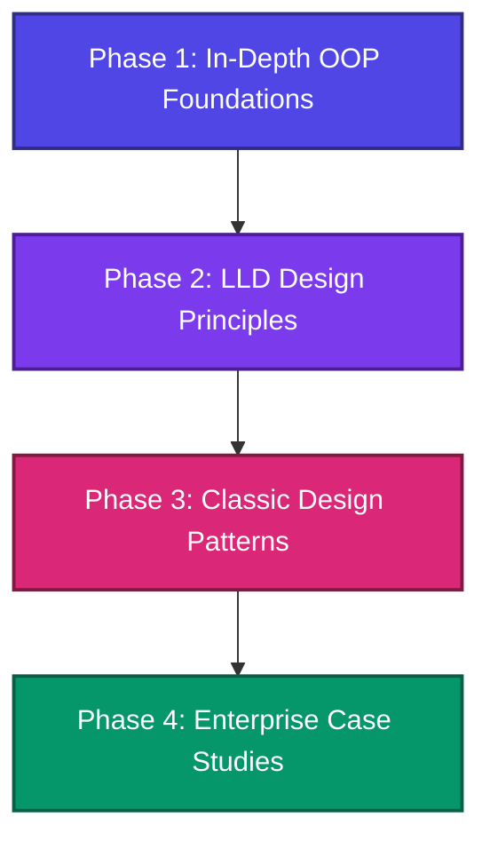

# 🏗️ Python OOP & Low-Level Design (LLD) Masterclass

Welcome to the ultimate Python Object-Oriented Programming (OOP) and Low-Level Design (LLD) curriculum. This repository is structured to take you from a basic understanding of variables and functions to designing complex, enterprise-grade, extensible, and clean systems.

If you are committed to making this your **last time learning these concepts**, this roadmap is designed to build a **permanent mental model** of how clean software is architected.

---

## 🗺️ Master Curriculum Roadmap

We have structured your learning journey into four distinct phases, each represented by a directory in this workspace. Follow them in sequence.



### 📦 [Phase 1: In-Depth OOP Foundations](file:///TRUENAS/personal%20file/from%20w11/dsa_vault/low_level_design/01_in_depth_oop)
Before designing large systems, you must master the building blocks. Python's OOP is dynamic, flexible, and has unique features (like dunder methods and metaclasses) that set it apart from languages like Java or C++.
- [ ] **[01_classes_objects.py](file:///TRUENAS/personal%20file/from%20w11/dsa_vault/low_level_design/01_in_depth_oop/01_classes_objects.py)**: Classes, instances, self, class variables vs instance variables, and memory layouts.
- [ ] **[02_pillars_of_oop.py](file:///TRUENAS/personal%20file/from%20w11/dsa_vault/low_level_design/01_in_depth_oop/02_pillars_of_oop.py)**: The 4 pillars: Encapsulation (name mangling, properties), Inheritance (types), Polymorphism (duck typing, operator overloading), Abstraction (ABCs).
- [ ] **[03_advanced_oop.py](file:///TRUENAS/personal%20file/from%20w11/dsa_vault/low_level_design/01_in_depth_oop/03_advanced_oop.py)**: MRO (Method Resolution Order), cooperative inheritance with `super()`, `__slots__` for memory optimization, descriptors, and Composition vs Inheritance.
- [ ] **[04_magic_dunder_methods.py](file:///TRUENAS/personal%20file/from%20w11/dsa_vault/low_level_design/01_in_depth_oop/04_magic_dunder_methods.py)**: Emulating built-in behaviors, context managers (`__enter__`/`__exit__`), custom sequence containers, and object lifecycle hook (`__new__` vs `__init__`).
- [ ] **[05_metaprogramming.py](file:///TRUENAS/personal%20file/from%20w11/dsa_vault/low_level_design/01_in_depth_oop/05_metaprogramming.py)**: Class decorators, dynamic class creation (`type()`), and metaclasses.

### 📐 [Phase 2: LLD Design Principles](file:///TRUENAS/personal%20file/from%20w11/dsa_vault/low_level_design/02_lld_principles)
Principles tell you *how* to organize your code to prevent it from becoming a tangled "spaghetti" mess.
- [ ] **[01_solid_principles.py](file:///TRUENAS/personal%20file/from%20w11/dsa_vault/low_level_design/02_lld_principles/01_solid_principles.py)**: Deep-dive into SOLID with interactive "bad code" vs "good code" implementations:
  - **S**ingle Responsibility (SRP)
  - **O**pen/Closed (OCP)
  - **L**iskov Substitution (LSP)
  - **I**nterface Segregation (ISP)
  - **D**ependency Inversion (DIP)
- [ ] **[02_other_principles.py](file:///TRUENAS/personal%20file/from%20w11/dsa_vault/low_level_design/02_lld_principles/02_other_principles.py)**: DRY (Don't Repeat Yourself), KISS (Keep It Simple, Stupid), YAGNI (You Aren't Gonna Need It), and Law of Demeter.

### 🎨 [Phase 3: Classic Design Patterns](file:///TRUENAS/personal%20file/from%20w11/dsa_vault/low_level_design/03_design_patterns)
Design patterns are reusable solutions to common software design problems. We cover the key Gang of Four (GoF) patterns with pythonic implementations:
- **Creational (How objects are created)**
  - [ ] **[singleton.py](file:///TRUENAS/personal%20file/from%20w11/dsa_vault/low_level_design/03_design_patterns/01_creational/singleton.py)**: Thread-safe singletons (via metaclasses, decorators, and module caching).
  - [ ] **[factory.py](file:///TRUENAS/personal%20file/from%20w11/dsa_vault/low_level_design/03_design_patterns/01_creational/factory.py)**: Factory Method and Abstract Factory patterns.
  - [ ] **[builder.py](file:///TRUENAS/personal%20file/from%20w11/dsa_vault/low_level_design/03_design_patterns/01_creational/builder.py)**: Creating complex objects step-by-step.
- **Structural (How objects relate to each other)**
  - [ ] **[adapter.py](file:///TRUENAS/personal%20file/from%20w11/dsa_vault/low_level_design/03_design_patterns/02_structural/adapter.py)**: Reconciling incompatible interfaces.
  - [ ] **[decorator.py](file:///TRUENAS/personal%20file/from%20w11/dsa_vault/low_level_design/03_design_patterns/02_structural/decorator.py)**: Dynamically adding behavior to objects without modifying subclasses.
  - [ ] **[facade.py](file:///TRUENAS/personal%20file/from%20w11/dsa_vault/low_level_design/03_design_patterns/02_structural/facade.py)**: Providing a simplified entry point to a complex subsystem.
  - [ ] **[proxy.py](file:///TRUENAS/personal%20file/from%20w11/dsa_vault/low_level_design/03_design_patterns/02_structural/proxy.py)**: Controlling access (logging, caching, lazy initialization) to an object.
- **Behavioral (How objects communicate)**
  - [ ] **[observer.py](file:///TRUENAS/personal%20file/from%20w11/dsa_vault/low_level_design/03_design_patterns/03_behavioral/observer.py)**: Publish-Subscribe events.
  - [ ] **[strategy.py](file:///TRUENAS/personal%20file/from%20w11/dsa_vault/low_level_design/03_design_patterns/03_behavioral/strategy.py)**: Interchangeable algorithms selected at runtime.
  - [ ] **[command.py](file:///TRUENAS/personal%20file/from%20w11/dsa_vault/low_level_design/03_design_patterns/03_behavioral/command.py)**: Encapsulating requests as objects (supports Undo/Redo).
  - [ ] **[state.py](file:///TRUENAS/personal%20file/from%20w11/dsa_vault/low_level_design/03_design_patterns/03_behavioral/state.py)**: Allowing an object to alter its behavior when its internal state changes.

### 🏢 [Phase 4: Enterprise Case Studies](file:///TRUENAS/personal%20file/from%20w11/dsa_vault/low_level_design/04_enterprise_case_studies)
This is where the rubber meets the road. We will design complete, executable, thread-safe, and modular systems mimicking real production requirements:
- [ ] **[01_parking_lot.py](file:///TRUENAS/personal%20file/from%20w11/dsa_vault/low_level_design/04_enterprise_case_studies/01_parking_lot.py)**: 
  - Multiple floors, spot types (Compact, Large, Handicap, Motorcycle).
  - Dynamic spot allocation (Nearest spot first, specific floors).
  - Ticket generation and concurrent payments via strategy pattern.
- [ ] **[02_splitwise.py](file:///TRUENAS/personal%20file/from%20w11/dsa_vault/low_level_design/04_enterprise_case_studies/02_splitwise.py)**:
  - Users, Groups, Expenses.
  - Split strategies (Equal, Exact, Percentage, Share).
  - **Transaction Minimization Algorithm** (Simplify Debt using Max/Min Heap or greedy approaches).
- [ ] **[03_elevator_system.py](file:///TRUENAS/personal%20file/from%20w11/dsa_vault/low_level_design/04_enterprise_case_studies/03_elevator_system.py)**:
  - State management of elevators (Idle, Moving Up, Moving Down).
  - Dispatcher algorithms (SCAN, LOOK, FCFS) controlling a bank of elevators.
  - Concurrency modeling and request queues.

---

## 🧠 The "Architect's Mental Model": How to Approach LLD

When given an LLD problem (in an interview or a real project), **never start coding immediately**. Follow this 5-step systematic process:

```
┌──────────────────────────┐
│   1. Gather Requirements  │ ➔ Identify Actors, Use Cases & Constraints
└─────────────┬────────────┘
              ▼
┌──────────────────────────┐
│    2. Define Core Domain │ ➔ Identify Classes, Attributes & Methods
└─────────────┬────────────┘
              ▼
┌──────────────────────────┐
│ 3. Establish Relations   │ ➔ Composition, Aggregation, Inheritance (draw UML)
└─────────────┬────────────┘
              ▼
┌──────────────────────────┐
│ 4. Apply Design Patterns │ ➔ SOLID, Singleton, Factory, Strategy, etc.
└─────────────┬────────────┘
              ▼
┌──────────────────────────┐
│  5. Implement Clean Code  │ ➔ Concurrency-safe, documented, and modular
└──────────────────────────┘
```

1. **Clarify Requirements & Constraints**:
   - Scope: What is in-scope vs out-of-scope? (e.g., in a parking lot, is booking a spot out-of-scope? Yes, keep it simple first).
   - Actors: Who interacts with the system? (e.g., Driver, Admin, Payment Processor).
2. **Identify Core Entities/Classes**:
   - nouns in requirements usually map to classes (e.g., Vehicle, ParkingSpot, Ticket).
   - verbs usually map to methods (e.g., parkVehicle(), issueTicket(), processPayment()).
3. **Determine Relationships (OOP Association/Composition)**:
   - *Composition* (Strong 'has-a' lifecycle bound): `ParkingFloor` has `ParkingSpot`s. If floor is deleted, spots are deleted.
   - *Aggregation* (Weak 'has-a' independent lifecycle): `ParkingSpot` has a `Vehicle`. If spot is cleared, vehicle still exists.
   - *Inheritance* ('is-a'): `Car` is a `Vehicle`, `Motorcycle` is a `Vehicle`.
4. **Choose Design Patterns**:
   - Need only one instance of configuration/registry? ➔ `Singleton`.
   - Need to instantiate varying objects based on input? ➔ `Factory`.
   - Need to change behavior at runtime? ➔ `Strategy`.
   - Need to notify multiple objects of updates? ➔ `Observer`.
5. **Code with Concurrency and Extensibility**:
   - Use python's `threading.Lock` for shared resource protection (e.g., booking the same parking spot).
   - Use type hinting (`typing`) and Abstract Base Classes (`abc`) to make the code robust and self-documenting.

---

## 🚀 How to Study This Vault

1. **Read and Run**: Every file has an executable `if __name__ == "__main__":` block that serves as a live, interactive execution of the concepts. Run them using:
   ```powershell
   python low_level_design/01_in_depth_oop/01_classes_objects.py
   ```
2. **Modify and Break**: The best way to learn is to change the code. Try changing a method, breaking an LSP principle, or implementing a new splitting algorithm in Splitwise.
3. **Build the Case Studies Yourself**: Look at the case study requirements, close the files, and try implementing the designs from scratch. Compare your solution to the enterprise-grade versions provided.

*Let's get started. Dive into Phase 1!*
